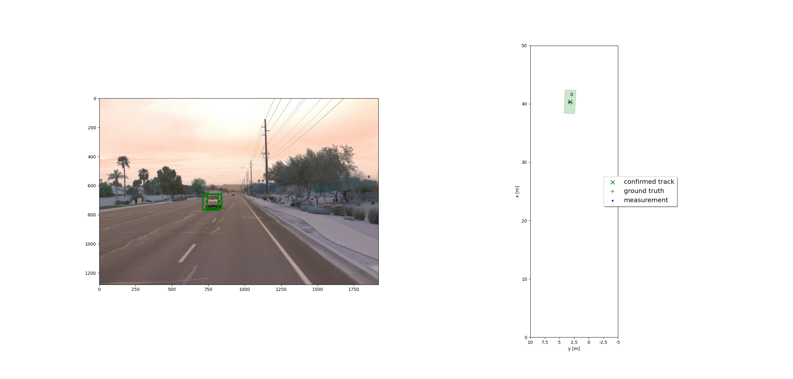
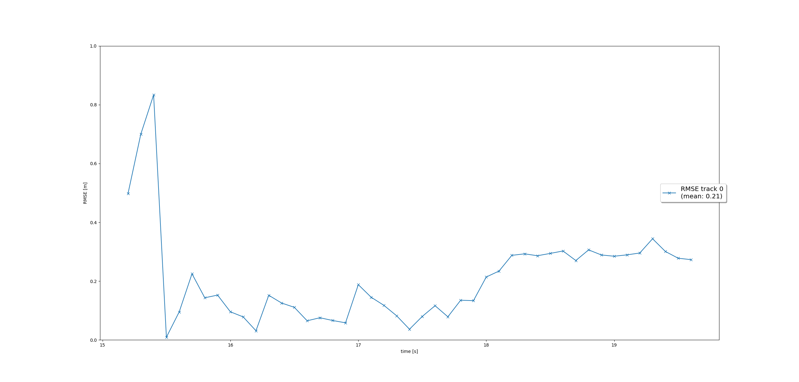
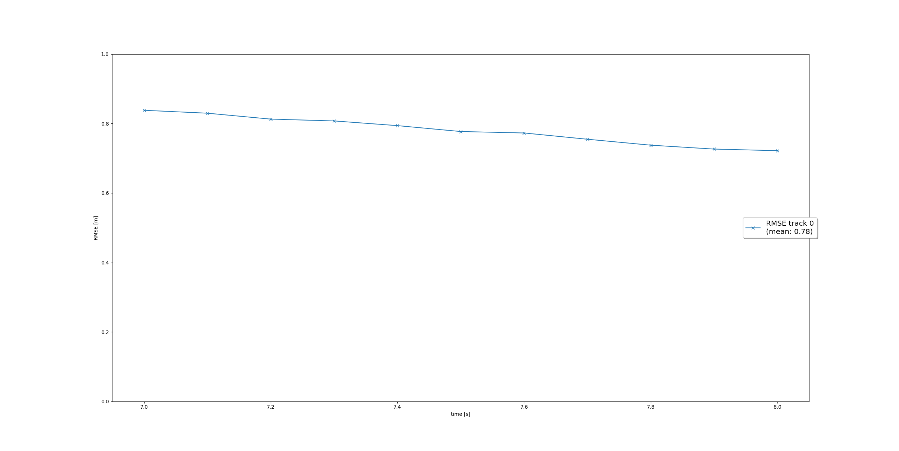
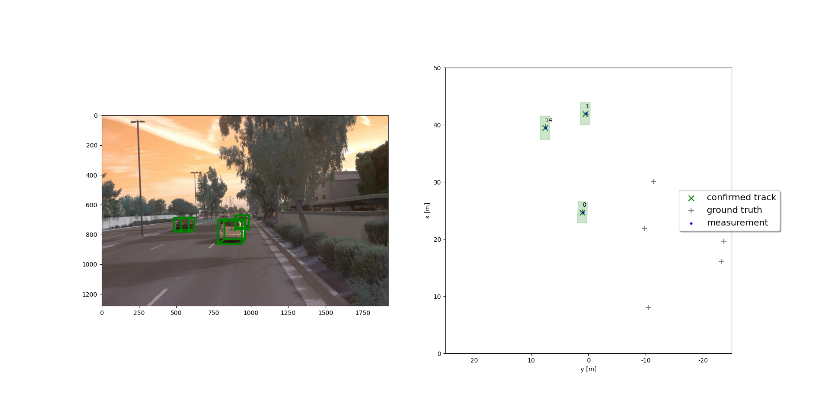
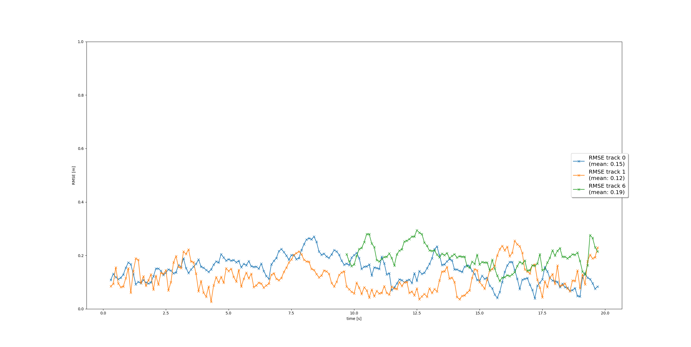

# Writeup: 3D Object Detection Final Project

## Step 1

For step 1, we were to develop an EKF (Extended Kalman Filter) in order to track a single object. A scenario was provided to facilitate this so that we didn't have to worry about associating measurements to multiple tracks or managing the tracks. 

Kalman Filters are used to estimate unknown variables by making predictions and updating these predictions using measurements. The measurement uncertainty needs to follow a Gaussian distribution and the resulting combination of measurement and predicted value will be more certain than the measurement alone.

Each iteration of the Kalman Filter involved making a prediction of 3D position and velocity using the previous state and then updating that prediction and it's uncertainty using a LiDAR measurement.

The RMSE (root mean square error) converged to around 0.2m which is within the range we wanted.

## Step 2

For step 2, we still only had one track, however, we added track management. We added a track state that could be either 'tentative', 'iniatialized', or 'confirmed'. We also added a track score. The track state would change based on the current track score. When we ran the loop, a track was created from the measurements of a single vehicle. The vehicle started as initialized, when the track score passed a certain threshold it changed to tentative, and when it passed another threshold it changed to confirmed. Eventually though, the vehicle left the frame and wasn't detectable anymore. Eventually due to the track score decreasing, and uncertainty increasing, we deleted the track.

## Step 3

In step 3, we added association between new measurements and tracks. To do this we used a method called Single Nearest Neighbor to determine which measurement belongs to which track. Single Nearest Neighbor uses the Mahalanobis distance which takes into account not just distance from a measurement to a track but also level of uncertainty.

In the end we were able to track 3 confirmed vehicles.

## Step 4

For step 4, we included camera data in our Extended Kalman Filter. By using LiDAR and camera measurement updates, we were able to produce more accurate tracking. Since the camera is non-linear we needed to use a Jacobian matrix for h(x) in order to approximate a linear function.

## Camera-LiDAR Sensor Fusion Benefits

LiDAR and camera sensors both have advantages and disadvantages when it comes to 3D tracking with self-driving vehicles. LiDAR gives accurate depth measurements across a 360° horizontal field-of-view but is more sparse in it's measurement points. Camera tends to have higher resolution but doesn't have depth information and has a more narrow field-of-view. By fusing the data of both sensor types, we should be able to get more accurate tracking results by taking advantage of the strengths of both. In this project, two of the tracks had a lower RMSE and therefore tracked better which suggests that the sensor fusion provided more accurate results than the LiDAR alone.

## Real-life Challenges

There are some real-life challenges with sensor fusion systems. If we are using sensors with different fields-of-view, we can end up with an oscillating tracking score as an object leaves the field-of-view of one sensor but is still within the field-of-view of another sensor. We can handle this by checking if a track is within the sensors field-of-view before updating the track score or by using detection probabilities. 

Another issue that can arise in these sensor fusion systems are when tracks are created for false positive detections such as from reflections. We can mitigate this by using a track score and a track state. We don't consider a track confirmed until the track score reaches a certain threshold and we delete a track if it falls below a certain threshold or the uncertainty becomes too big. This is something that we saw in this project, however, by setting our thresholds properly, we were able to dismiss the false positives.

## Tracking Improvements

There are a number of ways that we could improve the tracking results of this project. For one, we could play around with the track score thresholds which would affect when we consider tracks confirmed and when we delete tracks.

Another potential improvement would be to try out other association methods.

We could also change the threshold for gating.

Finally we could change our motion model to a bicycle model in order to more accurately predict vehicle motion.

