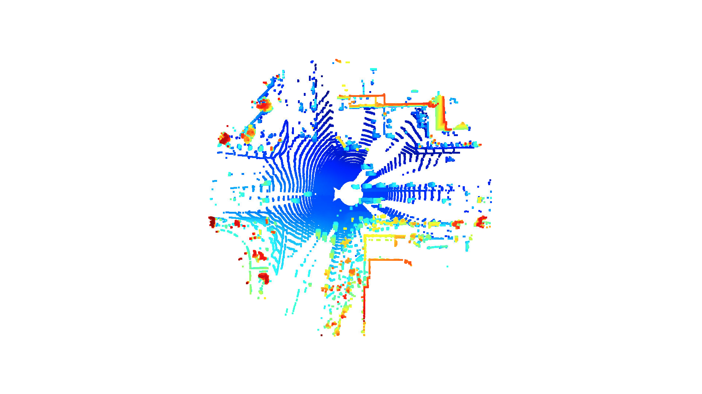
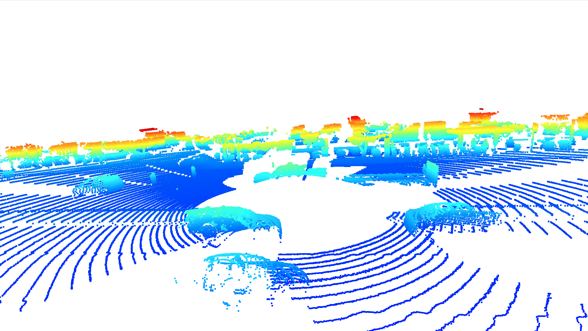
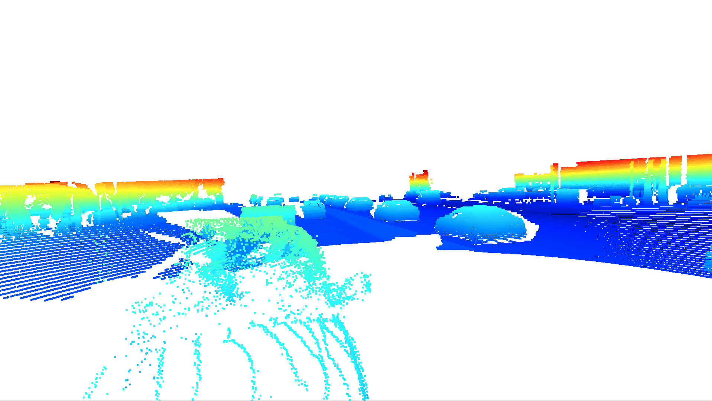
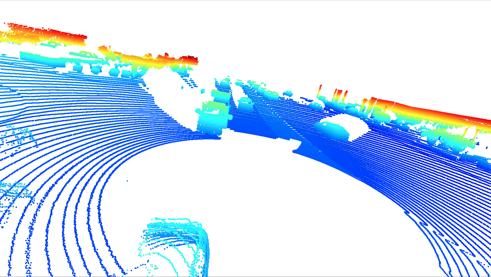
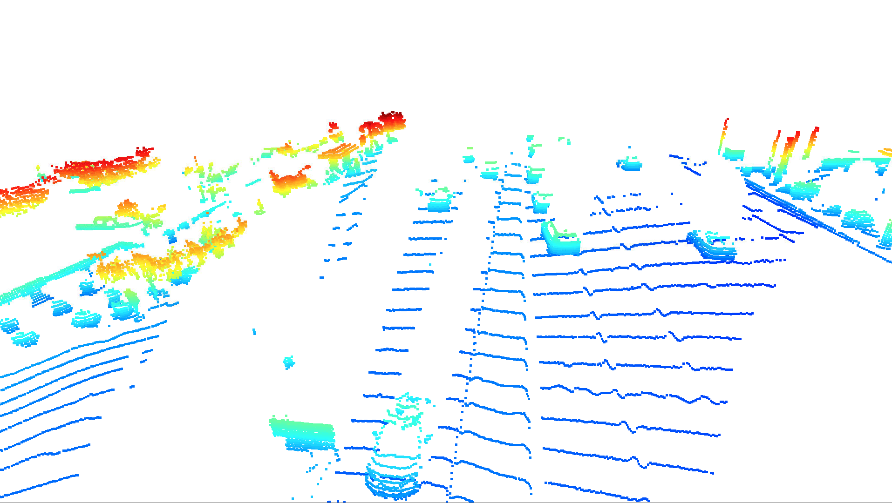
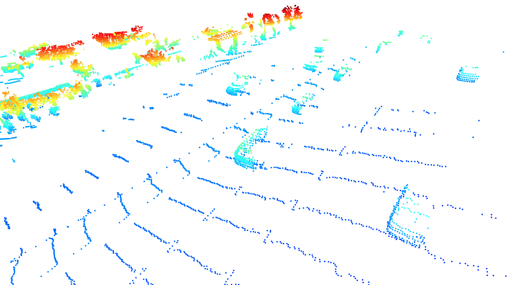
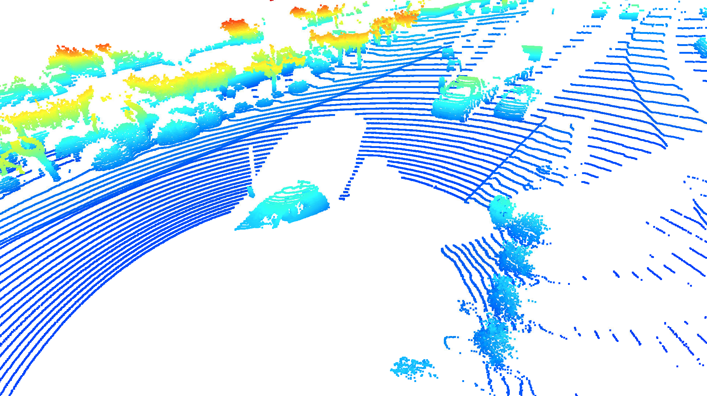
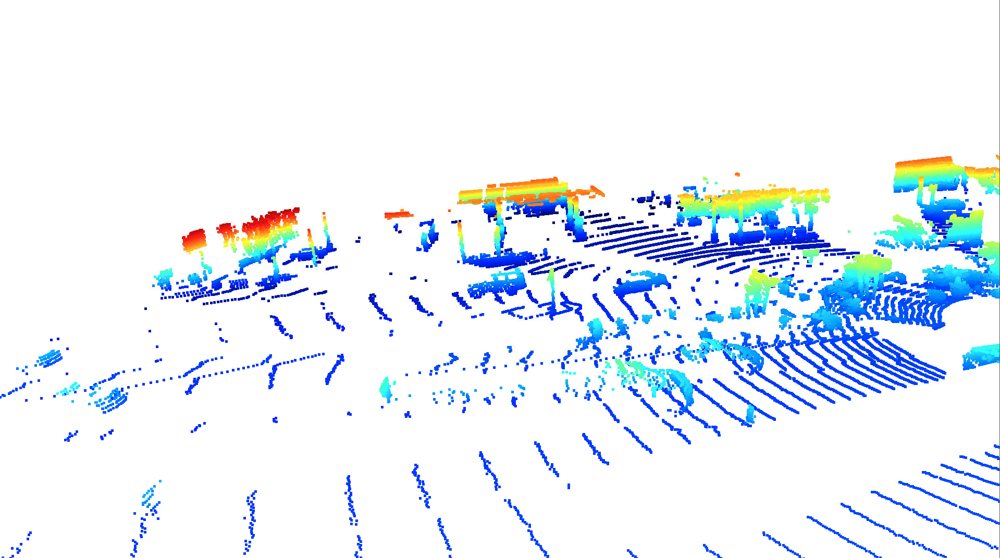
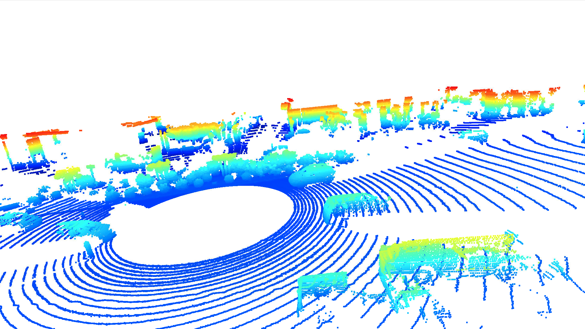
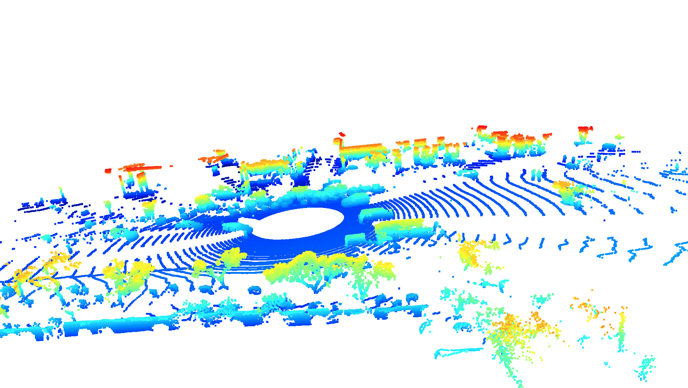

# Writeup: 3D Object Detection Midterm

## Section 1

### Exercise 1

### Exercise 2

Identifiable common features across these vehicle detections are:
- four tires
- side-view mirrors
- front and back windshield
- some number of side windows

