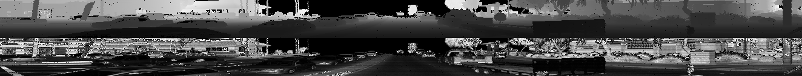
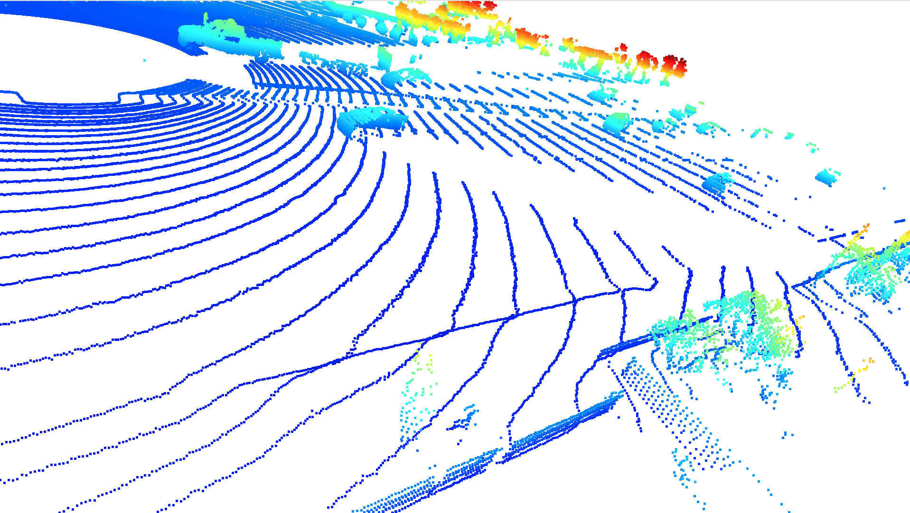
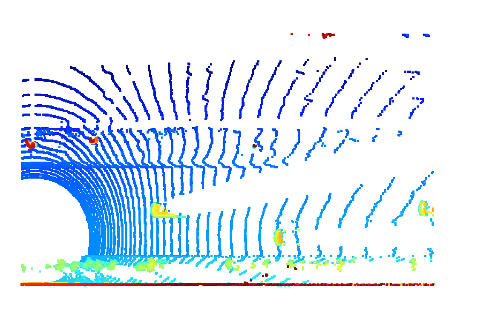
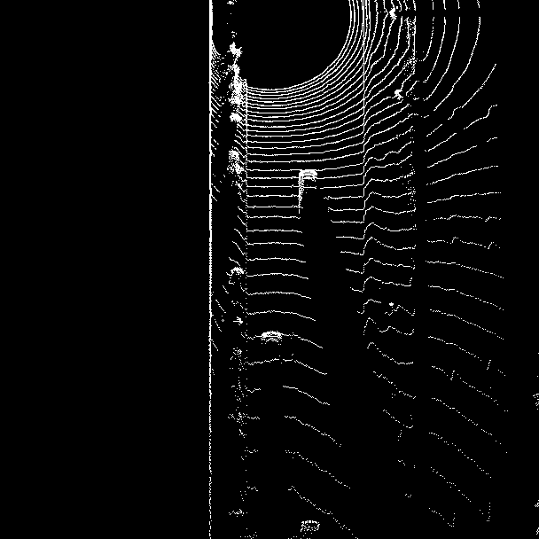
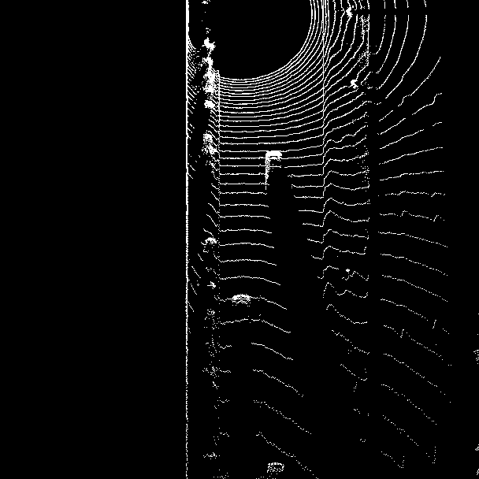
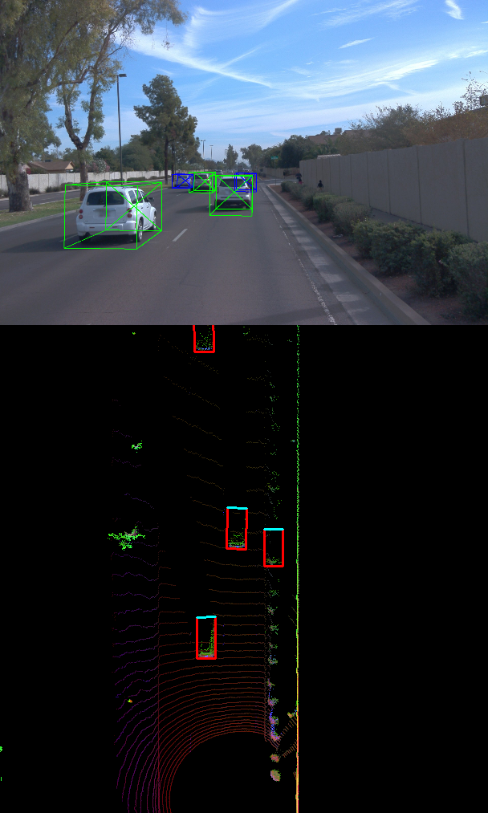
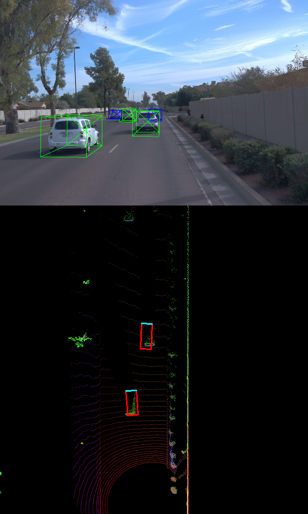
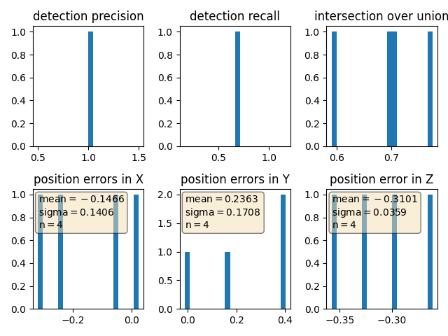

# Writeup: 3D Object Detection Midterm

## Section 1

### Exercise 1

### Exercise 2

Identifiable common features across the visible vehicles in the point clouds are:
- four tires
- side-view mirrors
- front and back windshield
- some number of side windows

Other objects that are visible within the point clouds include bushes, trees and walls.

## Section 2

### Exercise 1

### Exercise 2

### Exercise 3

## Section 3

### Exercise 2

Detections using Darknet model:

Detections using resnet:

### Exercise 3

`precision = 1.0, recall = 0.6666666666666666`

